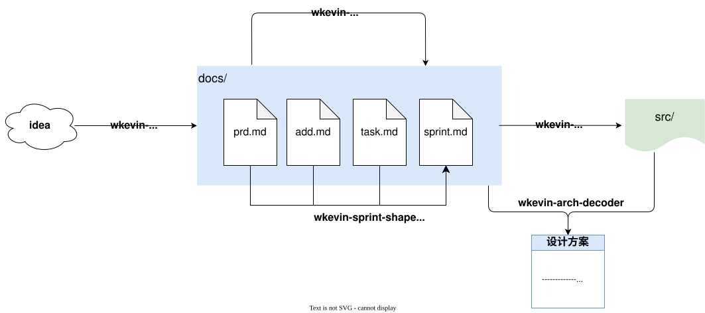

# wkevin's skills

**安装**

```sh
npx skills add https://github.com/wkevin/skills
......
◆  Select skills to install (space to toggle)
│  ◻ Dev
│  │ ◻ wk-arch-decoder
│  │ ◻ wk-doc-align
│  │ ◻ wk-idea-flesh
│  │ ◻ wk-sprint-shape
│  └ ◻ wk-task-dev
│  ◻ Utils
│  └ ◻ wk-srt-translate
```

## 开发类 Skills

<p align="center">
  <strong style="font-size:1.5em; color:#0d9488;">AI First -</strong>
  <span style="font-size:1.4em; color:#f97316;">从想法到版本，人只做创造和决策，剩下的都交给 Agent。</span>
</p>



### `wk-arch-decoder` - 架构解码器(从代码反推设计哲学)

**思考逻辑：**

经常看到一个优秀的 repo,但传统的 RTFSC 已经力不从心，让 AI 通读后输出人类阅读友好，而不是 AI 友好的文档 —— 对我来说是个刚需。

所以开发这个 skill，把”看代码”变成”**理解代码为什么这么写**”。区别于传统的”事实清点表”,本 skill 强调**判断、取舍、批判** —— 产出”有判断力的架构理解文档”,而不是简单复述源码。

同时本 skill 还可以用于那些只有 code、缺乏 doc，或者 doc 滞后于 code 的 repo —— 这在工作中通常也是常态，所以这种场景就是：开发者写 code,本 skill 生成文档,给领导或外部读者看。

**工作原理:**

- 通读 repo 源码和文档,**前置「上下文与心智模型」**(占 40% 时间)。
- 输出五视图(逻辑、数据、开发、运行、物理)的代码架构方案 —— 但每个事实陈述都配 **WHY 与判断**。
- 后置「决策视图(Roads Not Taken)+ 行为视图(AI 项目专属,扫 prompt / token / LLM 自主性)+ 凝结(反向 mental model)+ 批判性视角(强制 3 个毛病)」。
- 最终可用于人工手写方案的补充,弥补手写方案的修订不及时、与代码不一致等问题。

详见 [README](skills/dev/wk-arch-decoder/README.md)。

### `wk-doc-align` - 评估文档四件套及提出改进意见

**思考逻辑：**

项目级开发时，AI 会生成很多类型文档，时间一长，docs 文件夹下充斥着 decision-notes、brainstorm-notes、changelog…不但人类逐步无法阅读，而且 AI 也会上下文爆炸。

这些过程文档通常只有短暂的参考意义，因为 AI 可能在下次迭代就推翻了上次的技术架构 —— 这些逐步都无法被人类感知所以我的方法论是：只保留对人类有参考意义，人类可以参与互动的文档，我确定了4个，称之为四件套：

1. prd：产品需求
2. add：架构设计
3. tasks：UC/IF 定义（产品 catalog）
4. sprint：Sprint 计划 + Product Backlog（工程排期）

> 产品 catalog(tasks.md)跟 Sprint 排期(sprint.md)分离是 agile 方法论的核心 —— "想做什么" 跟 "现在做什么" 是两个独立问题。

**工作原理：**

- 评估 `docs/prd.md` / `docs/add.md` / `docs/tasks.md` / `docs/sprint.md` 是否符合 PRD + ADD + Tasks + Sprint 方法论。
- 输出 critical / important / nice-to-have 三级 issue 列表 + PASS / FIX / REWRITE verdict。**不是写作工具**,只评估不修改一字。
- 用户可根据输出决策要不要重构或修改文档

**使用方法：**

```sh
/wk-doc-align
```

或靠提示词触发

```sh
评估当前项目的文档，给出修改建议。
```

### `wk-idea-flesh` - 3 维度头脑风暴驱动的想法落地（拆分到 prd/add/tasks/sprint）

**思考逻辑：**

通常我们的 idea 是混合了需求、方案、Task 的，人类很难分得清这3者的区别，才造成了项目开发这的无数扯皮，面对 AI 这个问题不再存在，人类只需负责提供 idea, AI 负责拆分，然后人类 review —— review 是人类擅长的，有了 AI 的初稿，人类可以很快修订出自己想要的目标。

**工作原理：**

- 核心特性：3 维度头脑风暴 + 直接联动改 4 文档。
  - 跟用户多轮交互，把 idea 的**需求 / 方案 / 任务**3 个维度各自清晰化（共 3-6 轮 `AskUserQuestion`），然后**直接联动修改 `prd.md` / `add.md` / `tasks.md` / `sprint.md` 四个文档**。新产生的 UC/IF 同时进入 `tasks.md §1.1/§1.2`（完整定义）+ `sprint.md §2 Product Backlog`（等待排期）。
  - skill 内部决定 3 维度讨论深度（简单想法 3 轮，复杂想法 6 轮），不需要用户预先指定 [Type] / Mode / 排期。
- **不接**"开新版本 / 做 v0.X / 从 backlog 抽"等已规划操作 —— 那是版本规划的事，不属于"新想法"。

3 维度头脑风暴（每个维度必谈）：

| 维度     | 讨论什么                                 | 落到哪个文档                           |
| -------- | ---------------------------------------- | -------------------------------------- |
| **需求** | persona / 场景 / 价值 / 优先级 / UC 拆分 | `prd.md` §2/§4 + `tasks.md §1.1 UC`    |
| **方案** | 架构影响 / 决策点 / IF 拆分 / 视图更新   | `add.md` §1-§5/§7 + `tasks.md §1.2 IF` |
| **任务** | 排期意向 / 依赖 / 粒度                   | `sprint.md §2 Product Backlog`（暂存） |

**使用方法：**

```sh
/wk-idea-flesh 我要赚到一个小目标
```

### `wk-sprint-shape` - 从 backlog 塑形一个 Sprint（拆首次实现/升级/fix 三子节）

**思考逻辑：**

`wk-idea-flesh` 把模糊想法落到 `sprint.md §2 Product Backlog` 后，`wk-task-dev` 实现 `sprint.md §1 Sprint` 段内的 task——但中间缺一步："**哪些 UC/IF 该进哪个 Sprint？**"。人工排 Sprint 容易忽略依赖关系、凑不出主题，最后 Sprint 段像 task 列表没灵魂。

本 skill 在两者之间做 **agile Sprint Planning 的工程化**：通过「优先级 + 依赖图 + 主题聚类」三因子算法，从 backlog 挑 10-20 个 UC/IF，塑形一个 Sprint 段（代号 / 起止日期 / Goal / Version / 🟡 Planning 状态），**仅修改 `sprint.md`**，绝不改 PRD/ADD/Tasks。

**工作原理：**

- **三因子塑形算法**：
  - **优先级**：`tasks.md §1.1/§1.2` 标 `[P0/P1/P2/P3]` → 映射到 Sprint/Milestone/Production 三层候选池（内部 filter，不写文件）
  - **依赖图**：`tasks.md` 实现细节里显式"依赖"字段 + 扫描其他 UC/IF 编号交叉引用（推断）→ 拓扑排序生成 scaffold 序列
  - **主题聚类**：UC/IF 标题 + agile 三段式 + 实现细节分词聚类 → 主导主题 = Sprint 代号 + Goal
- **Sprint 内拆三子节**（doc-align §1.2.1）：首次实现 / 升级 / bug fix，每条标注前缀。
- **硬约束**：每个 Sprint 10-20 task（Scrum velocity 上限），Active Sprint ≤ 1（doc-align §1.4.1），Sprint 状态默认 🟡 Planning（不擅自激活）。

**使用方法：**

```sh
/wk-sprint-shape 做 v0.5,主题是批量导入
/wk-sprint-shape 规划下一版,10 个 task
/wk-sprint-shape 修改 Sprint 2,加 UC-04-05
```

### `wk-task-dev` - 批量开发 sprint.md Sprint 段中的 task

**思考逻辑：**

当 `sprint.md §2 Product Backlog` 里累积了一堆待开发的 UC/IF,并被排进 §1 Sprint 段后,人工逐个去实现效率太低,容易遗漏。批量启动 AI 自动化实现是更高效的方式 —— AI 一次性拉取指定 Version 或 task id 列表,按依赖顺序逐个实现,每个 task 完成就 commit 一次,过程中无需确认,适合作业给 AI 长跑。

**工作原理：**
读取 `sprint.md §1` 中指定 Version(精确匹配 `v0.5` / `v1.0-rc` 等)或单个 task id(`UC-XX-YY` / `IF-XX-YY`),从 `tasks.md`/`prd.md`/`add.md` 取 UC/IF 完整定义与上下文(只读),按顺序逐个实现,完成后**仅在 `sprint.md` 把对应 task 状态 `[]` → `[x]`** 并做一次 git commit(`feat(UC-XX-YY): ...` 风格)。`prd.md` / `add.md` / `tasks.md` 在本 skill 中**只读**。整个流程不需中途打断,适合长时间无人工干预的批量开发。

**使用方法：**

```sh
/wk-task-dev UC-03-02         # 实现 id 为 UC-03-02 的 User Case
/wk-task-dev IF-04-01         # 实现 id 为 IF-04-01 的 Inner Feature
/wk-task-dev v0.5             # 实现 v0.5 version 的所有 tasks（含 UC、IF）
```

## 效率类 Skills

### `wk-srt-translate` - 字幕翻译

SRT 字幕文件翻译 skill —— 使用并行 AI subagents 加速字幕翻译，按语义边界拆 chunk、并行翻译、按序拼接。

**使用方法：**

```sh
/srt-translate <file.srt> [--workers <worker-number>] [--output <output_file>] [--max-entries <max-entries-number>]
```

- `file.srt` — 源 SRT 文件路径（必填）
- `--workers <worker-number>` — 并行 worker 数（默认：3）
- `--output <file>` — 输出文件路径（默认：`original_CN.srt`）
- `--max-entries <max-entries-number>` — 拆分时每个部分最多的条目数量（默认 200）
