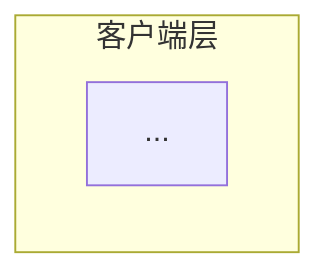
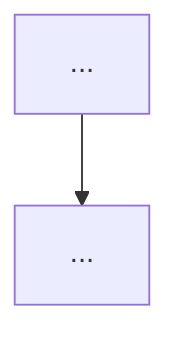
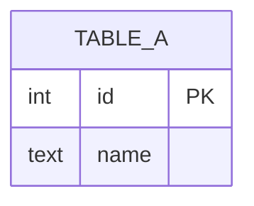
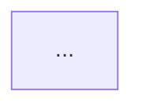

# [仓库名称] 架构分析报告

> **仓库地址**: [URL 或本地路径]
> **分析时间**: [YYYY-MM-DD]
> **技术栈**: [主要语言/框架]
> **项目类型**: [AI/Agent | Web 应用 | CLI | 数据基础设施 | 框架/SDK | 其他]
> **读者意图**: [新人入职 | 决策评估 | 学习偷师 | 故障排查 | 二次开发]
> **标注说明**: 📋 事实 · 💭 判断 · ❓ 疑问 · ⚠️ 可能失实

> **📖 读者导览**:本报告由 `wk-arch-decoder`(架构解码器)产出,共 **7 个视图 + 1 个批判视角**,**不是"五视图"**。结构如下:
>
> | 章节 | 视图 | 来源阶段 | 适用读者意图 |
> |---|---|---|---|
> | 0 | 上下文与心智模型 | Phase 0 | 所有人(强制前置) |
> | 1 | 逻辑视图 | Phase 1.① | 新人、二次开发 |
> | 2 | 数据视图 | Phase 1.② | 二次开发、决策评估 |
> | 3 | 开发视图 | Phase 1.③ | 二次开发、学习偷师 |
> | 4 | 运行视图 | Phase 1.④ | 故障排查 |
> | 5 | 物理视图 | Phase 1.⑤ | 决策评估 |
> | 6 | **决策视图** ⭐ | Phase 2(新增) | 决策评估、二次开发 |
> | 7 | **行为视图** ⭐ | Phase 3(新增,AI 项目专属) | 学习偷师、二次开发 |
> | 8 | **凝结** ⭐ | Phase 4(新增) | 所有人(必读) |
> | 9 | **批判性视角** ⭐ | Phase 5(新增) | 决策评估、code review |
> | A-D | 附录 | Phase 6 | 元数据 |
>
> **五视图**(1-5)是基础;**决策 + 行为 + 凝结 + 批判**(6-9)是解码器的差异化能力 —— 决定本次分析是"清点表"还是"理解文档"的关键。

---

## 0. 上下文与心智模型 (Context & Mental Model) ⭐

### 0.1 项目想解决的根本痛点

📋 (从 README 第一段抓,一句话)

### 0.2 项目的核心信念 / 隐含假设

💭 提炼自 README/CLAUDE.md/SKILL.md 等软文档反复强调的话:

1. 信念 1: ...
2. 信念 2: ...
3. 信念 3: ...

### 0.3 跟同类项目的差异化

💭 跟 [X] / [Y] 相比,这个项目**刻意不做** [Z],因为 [理由]。

### 0.4 核心 mental model (Phase 4 会反向校验)

💭 这个项目可以浓缩为:

> "..."

### 0.5 项目类型 → 加载对应 checklist

- 项目类型: [AI/Agent 项目]
- 必看维度: Prompt 位置 / Token 经济 / LLM 自主性 / 触发机制 / 多 Agent 协作 / Safety 护栏

### 0.6 软文档清单(Phase 0 实际读了哪些)

| 文档 | 角色 | 关键信息 |
|---|---|---|
| README.md | 世界观 | ... |
| CLAUDE.md | 操作契约 | ... |
| docs/workflow/SELF-LEARNING.md | 设计哲学 | ... |
| skill/SKILL.md | 调用策略 | ... |
| ... | ... | ... |

---

## 1. 逻辑视图 (Logical View)

### 1.1 模块职责划分

| 模块 | 职责 | **WHY 这么设计** | 边界 |
|---|---|---|---|
| ... | ... | (不能写"为了清晰"。必须具体:"和模块 X 分离是因为...,合并会导致...") | ... |

### 1.2 逻辑分层架构图



📋 **图揭示了什么(事实层)**: ...

💭 **这个分层意味着什么(判断层)**: 这种分层把 X 和 Y 解耦在两层 —— 上层 [...] 下层 [...]。这是一个**罕见的清醒**/**典型的过度设计**/**...**。

### 1.3 核心业务链路

**链路 1: [名称]**



📋 **链路解释**: ...

💭 **这条链路揭示的设计取舍**: ...

**链路 2: [名称]**

(同上结构)

---

## 2. 数据视图 (Data View)

### 2.1 存储选型表

| 数据类型 | 存储选型 | **WHY 不用 X (典型替代)** |
|---|---|---|
| 文档内容 | SQLite | 不用 PostgreSQL 是因为:① 增加部署依赖,违反 zero-dependency 设计;② 单用户场景 WAL 已够并发 |
| ... | ... | ... |

### 2.2 核心 ER 模型



📋 **ER 图揭示**: ...

💭 **隐式 schema 警示**: ⚠️ 字段 `key_topics` 实际是 JSON 字符串(`JSON.stringify` 后存),不是简单字符串 —— 读取时需 `JSON.parse`。

### 2.3 数据一致性保障

(分布式事务 / 最终一致性 / 单文件无事务)

---

## 3. 开发视图 (Development View)

### 3.1 技术栈矩阵

| 类别 | 技术 | 版本 | **WHY 选这个 vs 替代** |
|---|---|---|---|
| 运行时 | Node.js | ≥20 | 不用 Bun:生态成熟度;不用 Deno:MCP SDK 兼容 |
| ... | ... | ... | ... |

### 3.2 模块依赖关系图



📋 **依赖图揭示**: ...

💭 **依赖结构判断**: 模块 A 是 god node(被 N 个模块依赖),如果重构需特别小心。

### 3.3 工程目录结构

```
/src
├── ...
```

### 3.4 ⭐ 刻意没引入的依赖 (Roads Not Taken in Deps)

| 没引入 | 类比项目通常会用 | **作者为什么没用** |
|---|---|---|
| LangChain | RAG 项目都用 | ... |
| Redis | 高并发缓存常见 | ... |
| Docker | 现代项目默认带 | ... |

> 💭 这一栏是 v2.0 的核心 —— **"刻意没引入的依赖"往往比"引入了什么"更能反映设计哲学**。

---

## 4. 运行视图 (Runtime View)

### 4.1 核心 API 时序图

```mermaid
sequenceDiagram
    participant Client
    participant Server
    participant DB
    ...
```

📋 **时序图揭示**: ...

💭 **运行时设计判断**: ...

### 4.2 并发与高可用机制(带失败模式)

| 机制 | 实现方式 | 位置 | **失败模式** |
|---|---|---|---|
| WAL 并发读 | `journal_mode=WAL` | db.js:11 | 磁盘满 → 写阻塞 → 整库挂 |
| 索引互斥锁 | `let indexing=false` 内存变量 | indexer.js:10 | 进程崩溃后锁状态丢失,重启自然恢复 |
| ... | ... | ... | ... |

---

## 5. 物理视图 (Physical View)

### 5.1 部署拓扑架构


📋 **部署拓扑**: ...

💭 **拓扑设计判断**: ...

### 5.2 高可用 / 容灾规划

| 维度 | 当前实现 | 缺陷 |
|---|---|---|
| 进程保活 | systemd Restart=on-failure | ✅ 充分 |
| 数据备份 | 无 | ⚠️ 用户自行 rsync |
| 多地容灾 | 无 | ⚠️ 单文件 SQLite 天然限制 |

### 5.3 ⭐ 水平扩展瓶颈

💭 **会在哪一层先撞墙**:

- 当用户数 > N 时: ...
- 当数据量 > M 时: ...
- 当 QPS > Q 时: ...

---

## 6. 决策视图 (Decision View) ⭐ v2.0 新增

### 6.1 关键架构决策 (ADR)

| # | 决策点 | 选项 | 选了什么 | 理由 | 好的后果 | 坏的后果 |
|---|---|---|---|---|---|---|
| 1 | 持久化层 | SQLite vs PostgreSQL vs File | SQLite + WAL | zero-deps、单文件部署 | 零运维 | 难水平扩展 |
| 2 | ... | ... | ... | ... | ... | ... |

### 6.2 显式取舍 (Trade-offs)

(作者明确放弃了什么,换来了什么)

- 放弃 [X],换 [Y]: ...
- 放弃 [A],换 [B]: ...

### 6.3 ⭐ 未走的路 (Roads Not Taken)

| 没做 | 同类项目通常做 | **为什么不做** |
|---|---|---|
| 没用 LangGraph 编排 | RAG 项目常见 | LLM 自主决策 > 框架编排,见 SKILL.md:12 |
| 没用 hook 强制触发工具 | 自动化常见 | 会得到垃圾笔记,质量 > 数量 |
| 没做 ANN 向量索引 | 大规模向量库标配 | <2000 条暴力扫够用,坦诚承认局限 |
| ... | ... | ... |

### 6.4 ⭐ 失败模式 (Failure Modes)

- **数据量上限**: ...
- **并发上限**: ...
- **依赖故障**: 当 X 不可用时,系统会 ...
- **关键 assumption**: 这个项目假设 [Z],一旦不成立会 ...

### 6.5 适用边界 (When NOT to use)

💭 这个项目**不适合**以下场景:

- 企业级合规审计(没有强 SLA 保证)
- 大型多人协作(权限模型简陋)
- 高安全场景(...)

---

## 7. 行为视图 (Behavior View) ⭐ v2.0 新增 (AI 项目专属)

### 7.1 LLM 决策触发链

| 触发器 | 类型 | 何时触发 | 由谁定义 |
|---|---|---|---|
| `tool_xxx` 调用 | LLM 自主 | LLM 看完 description 决定 | tool description |
| ... | ... | ... | ... |

**3 个核心问题**:

1. **是 hook 还是 LLM 自主?** 答: ...
2. **及时性怎么保证?** 答: 写入强保证(代码层)+ 触发软保证(提示层)+ 后备机制 ...
3. **完整性怎么保证?** 答: zod schema 强制 + 幂等去重 + 容错降级;但内容质量保证不了

### 7.2 ⭐ 提示工程位置图 (Prompt Location Map)

| 位置 | 内容片段 | 谁会看到 | 何时看到 |
|---|---|---|---|
| `tools.js:229` | `"IMPORTANT: Call this at the end of every significant session"` | LLM | tool list 加载 |
| zod schema `.describe()` `tools.js:230-239` | "What was the session trying to accomplish" | LLM | tool 调用前 |
| `CLAUDE.md.template:76-91` | "Session Capture is MANDATORY" | Claude | session 启动 |
| `AGENTS.md.template:43-58` | (同上的 Agent 通用版) | Codex/Gemini | session 启动 |
| `skill/SKILL.md:46-58` | "After completing work, capture..." | Claude | skill 激活 |

💭 **观察**: 同一规则在 5 个位置出现 —— 这是**冗余胜过精确**的哲学体现,对抗 LLM 注意力衰减。

### 7.3 Token 经济

| 设计 | 省 token 方式 | 节省量 |
|---|---|---|
| `kb_context` 分级 | summary → snippet → full | 90%+ |
| 量化 embedding | 4 位量化 | 4× |
| BLOB 存向量 | Float32Array vs JSON | 3× |
| ... | ... | ... |

### 7.4 LLM 自主性 vs 确定性

- **自主决策**: 调哪个 tool / 何时调 / 字段填什么内容
- **强制确定性**: `ADMIN_ONLY_TOOLS` 屏蔽危险工具 / zod schema 校验字段类型 / safety_check 必查
- **取舍**: 作者明确放弃 100% 触发率,换来不被自动化污染的高质量笔记

### 7.5 多 Agent 协作模式

- **隔离层**: MCP session(每会话独立 transport + McpServer 实例)
- **共享层**: SQLite 单文件(WAL 多进程并发)
- **一致性模型**: 强一致(单文件无分布式问题)
- **冲突解决**: `indexing` 互斥锁 + sha256 增量幂等

---

## 8. 凝结 (Synthesis) ⭐ v2.0 新增

### 8.1 一句话核心抽象

> "..."(30 秒理解测试:让没看过代码的人能否凭这句话理解项目本质?)

### 8.2 3 个最关键设计决策(骨架)

1. **[决策 A]** —— 其他决策都是为它服务
2. **[决策 B]** —— ...
3. **[决策 C]** —— ...

### 8.3 作者最不希望被改坏的部分(项目灵魂)

💭 从代码风格 / 注释口吻 / 文档反复强调中提炼:

- ...
- ...

### 8.4 与 Phase 0.4 mental model 对照

- Phase 0 预设: "..."
- Phase 1-3 验证后修正为: "..."
- 修正原因: ...

---

## 9. 批判性视角 (Critical Lens) ⭐ v2.0 新增

> 即使项目质量很高,**强制**写满 3 个最大毛病。

### 9.1 如果做代码评审,我会挑这 3 个最大毛病

1. **[毛病 1]**: ...
   - 影响范围: ...
   - 修复成本: ...
   - 建议方案: ...

2. **[毛病 2]**: ...
3. **[毛病 3]**: ...

### 9.2 这个项目的 hype 风险

💭 作者可能过度推销了什么?哪些 claim 实际不一定成立?

- Claim "X" 实际是 ...
- ...

### 9.3 二次开发的常见陷阱

新人接手最容易踩的坑:

- 陷阱 1: ...
- 陷阱 2: ...

---

## 附录

### A. 关键文件索引

| 主题 | 文件:行号 | 备注 |
|---|---|---|
| ... | ... | ... |

### B. 软文档清单

| 文档 | 路径 | 重要性 |
|---|---|---|
| ... | ... | ... |

### C. 无法确定的推测

⚠️ 以下内容是基于代码推测,需要作者确认:

- 推测 1: ...
- 推测 2: ...

### D. 分析过程元数据

- **耗时分布**:
  - Phase 0 (上下文): X%
  - Phase 1 (五视图): X%
  - Phase 2-3 (决策/行为): X%
  - Phase 4-5 (凝结/批判): X%
- **跳过的阶段**: (如果有,说明原因)
- **本次分析的盲点**: (诚实承认哪些没看)
