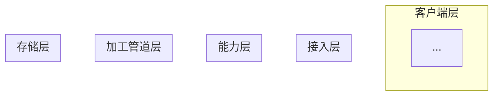
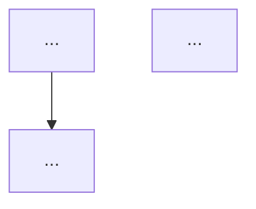
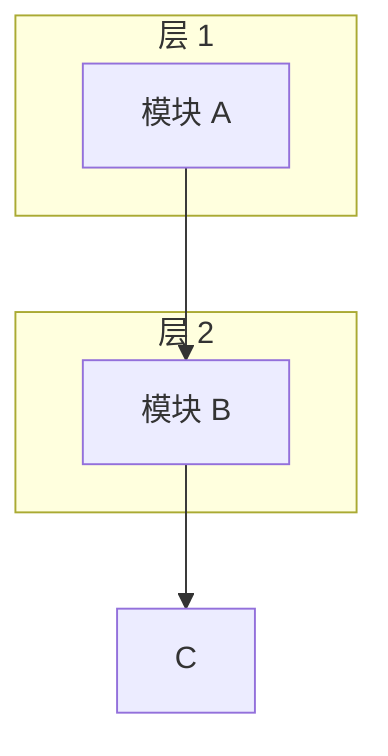
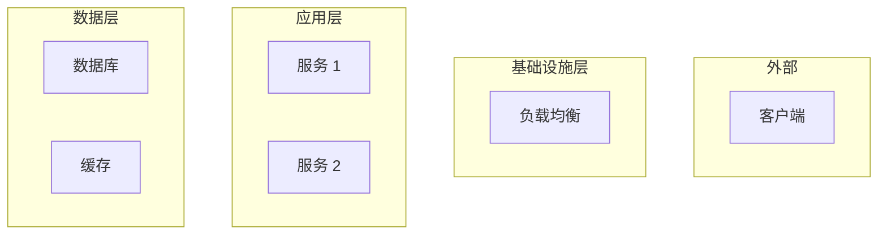

# [仓库名称] 架构分析报告 (五视图法)

> **仓库地址**: [URL 或本地路径]
> **分析时间**: [YYYY-MM-DD]
> **技术栈**: [主要语言/框架]

---

## 1. 逻辑架构 (Logical View)

### 1.1 模块职责划分

| 模块 | 职责 | 边界 |
| ---- | ---- | ---- |
| ...  | ...  | ...  |

### 1.2 逻辑分层架构图



### 1.3 核心业务链路

**链路 1: [名称]**



**链路 2: [名称]**

```mermaid
sequenceDiagram
    participant A
    participant B
    ...
```

---

## 2. 数据架构 (Data View)

### 2.1 存储选型表

| 数据类型 | 存储选型 | 理由 |
| -------- | -------- | ---- |
| ...      | ...      | ...  |

### 2.2 核心 ER / 表结构设计

```mermaid
erDiagram
    TABLE_A {
        int id PK
        text name
        ...
    }
    TABLE_B {
        int id PK
        int foreign_id FK
        ...
    }
    TABLE_A ||--o{ TABLE_B : relation
```

### 2.3 数据一致性保障

[分布式事务/最终一致性方案]

---

## 3. 开发架构 (Development View)

### 3.1 技术栈矩阵

| 类别 | 技术 | 版本 |
| ---- | ---- | ---- |
| 语言 | ...  | ...  |
| 框架 | ...  | ...  |
| ...  | ...  | ...  |

### 3.2 模块依赖关系图



### 3.3 工程目录结构

```
/src
├── ...
```

### 3.4 依赖管理规范

[依赖管理方式和规范]

---

## 4. 运行架构 (Runtime View)

### 4.1 核心时序链路

```mermaid
sequenceDiagram
    participant Client
    participant Gateway
    participant Service
    participant DB
    ...
```

### 4.2 并发与高可用处理

| 机制 | 实现方式 | 位置 |
| ---- | -------- | ---- |
| 缓存 | ...      | ...  |
| 异步 | ...      | ...  |
| 限流 | ...      | ...  |

---

## 5. 物理架构 (Physical View)

### 5.1 部署拓扑架构



### 5.2 高可用/容灾规划

[推测的高可用方案]

---

## 附录

### A. 关键文件索引

| 文件路径 | 说明 |
| -------- | ---- |
| ...      | ...  |

### B. 无法确定的推测

[根据代码无法确定、需要进一步确认的信息]
